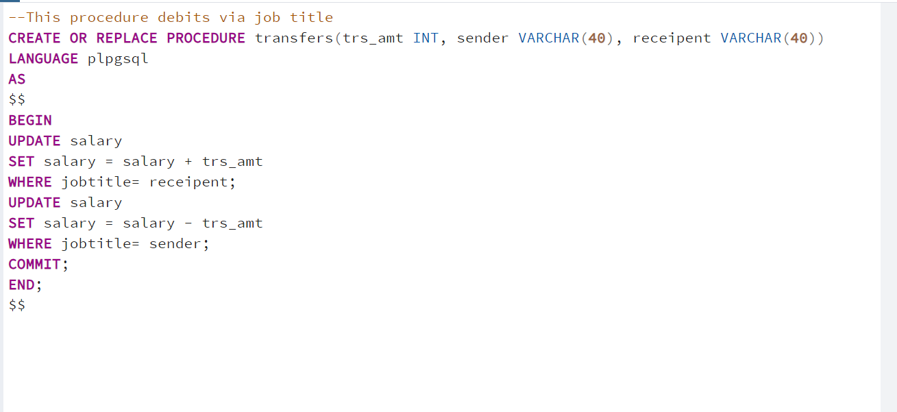

# 
 SQL_function-procedures
This project goes to demonstrate how functions and procedures are created in SQL.

# 
 Overview
The data used for this project was that of a salary data, which is fictional.  it has only one table with 6 columns.

# 
 Stored Procedures
Stored procedures is a hardcoded action that is stored to gain actionable and quick insight. It also can be called multiple times within the query. The procedure created was meant to debit and credit based off on job title.
The procedure is called by the CALL function alongside the procedure name, it has three parameters which it holds; the trnasaction amount, the sender and the receiver.

---

# 
 Functions
Functions are hardcoded to carry out calculation, manipulations of data and ultimately return data.
## Function 1
The function was created to return the total amount earned by a specific gender in a field/job title. The function is called using the SELECT statement alongsides the function name,it received two parameters; the jobtitle and the sex.

--

---
